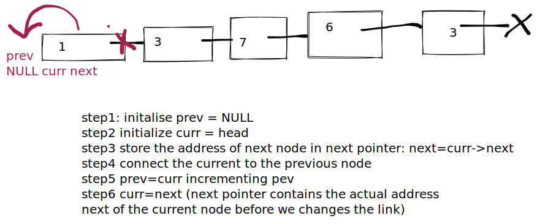

# Reverse Linked list

Given the `head` of a singly linked list, reverse the list, and return _the reversed list_.

&#x20;

**Example 1:**


```
Input: head = [1,2,3,4,5]
Output: [5,4,3,2,1]
```

**Example 2:**


```
Input: head = [1,2]
Output: [2,1]
```

**Example 3:**

```
Input: head = []
Output: []
```

&#x20;

**Constraints:**

* The number of nodes in the list is the range `[0, 5000]`.
* `-5000 <= Node.val <= 5000`

&#x20;

**Follow up:** A linked list can be reversed either iteratively or recursively. Could you implement both?

**Iterative Approach**



```
/**
 * Definition for singly-linked list.
 * struct ListNode {
 *     int val;
 *     ListNode *next;
 *     ListNode() : val(0), next(nullptr) {}
 *     ListNode(int x) : val(x), next(nullptr) {}
 *     ListNode(int x, ListNode *next) : val(x), next(next) {}
 * };
 */
class Solution {
public:
    ListNode* reverseList(ListNode* head) {
        if(head==NULL || head->next==NULL) return head;
        ListNode *curr,*prev,*next;
        curr=head;
        prev=NULL;
        while(curr!=NULL){
            next=curr->next;
            curr->next = prev;
            prev=curr;
            curr=next;
        }
        
        return prev;
    }
};
```

**Recursive solution**

```
/**
 * Definition for singly-linked list.
 * struct ListNode {
 *     int val;
 *     ListNode *next;
 *     ListNode() : val(0), next(nullptr) {}
 *     ListNode(int x) : val(x), next(nullptr) {}
 *     ListNode(int x, ListNode *next) : val(x), next(next) {}
 * };
 */
class Solution {
public:
    ListNode* reverse(ListNode* head, ListNode* prev){
        if(head==NULL){
            
            // we will return prev as it contains the address of our new lreverse list node
            return prev;
        }
        // we solve for the current case and then we let the recursion solve it
        ListNode *next = head->next;
        //head is our current node
        head->next = prev;
        
        //call for the next node and makeing the current node our new previous(prev)
        return  reverse(next,head);
    }
    ListNode* reverseList(ListNode* head) {
            return reverse(head,NULL);
        }
};
```
